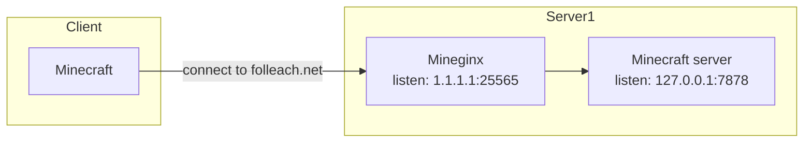
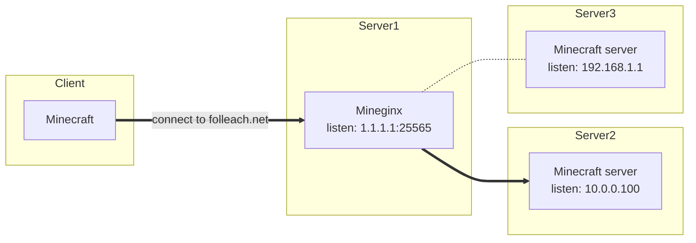
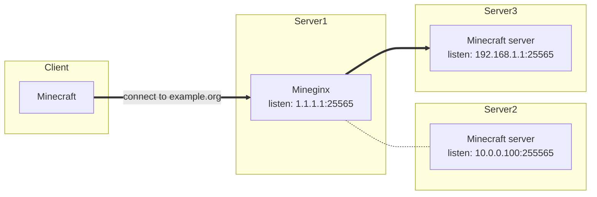

# Mineginx

**A lightweight minecraft proxy server**  
Made to host multiple minecraft servers on the same ``ip:port`` with different domains.  
Inspired by [nginx](https://nginx.org/)

Can proxy anything starting from version 1.7.2 and above

## Configuration

In the configuration, you can specify servers list

| name | description |
| ---- | ----------- |
| `listen` | The address to which the clients will connect<br/>Can be any interface address, or 0.0.0.0 for any |
| `server_name` | The domain for which the redirect will be applied.<br>The domain is taken from the server address in the client |
| `proxy_pass` | Address to minecraft server for redirect |

### Configuration examples

#### Single server machine
```yaml
# Server1
# config/mineginx.yaml
servers:
- listen: "1.1.1.1:25565" # your public ip or 0.0.0.0 (any) and port
  server_name: "folleach.net" # domain, which will be redirected
  proxy_pass: "127.0.0.1:7878" # upstream server (vanilla, fabric, etc...)
```

NOTE: if the clients connect to other domain addresses or the `server1` ip address (1.1.1.1), the connection will be closed by mineginx



DNS records
| Type | Name         | Content |
| ---- | ------------ | ------- |
| A    | folleach.net | 1.1.1.1 |

#### One proxy, multiple minecraft servers

```yaml
# Server1
# config/mineginx.yaml
servers:
- listen: "0.0.0.0:25565"
  server_name: "folleach.net"
  proxy_pass: "10.0.0.100:25565"

- listen: "0.0.0.0:25565"
  server_name: "example.org"
  proxy_pass: "192.168.1.1:25565"
```

Sure, you can listen multiple port too.  
Mineginx creates one server socket for one port

So, if you connect to the **folleach.net**, you will be redirected to the Server2


Or if you connect to the **example.org**, you will redirected to the Server3


DNS records
| Type | Name         | Content |
| ---- | ------------ | ------- |
| A    | folleach.net | 1.1.1.1 |
| A    | example.org  | 1.1.1.1 |

## Build & Run

```bash
cargo b -r && ./target/release/mineginx
```

## Limitations

### Max ~65k established connection to one upstream

Since `mineginx` is a proxy, connection will look like this
```
minecraft client -> proxy   -> minecraft server
1.2.3.4             1.1.1.1    10.0.0.1
```
This means that all connections will be created including between 1.1.1.1 and 10.0.0.1.  
Operating systems will not be able to keep more than 65k connections between the same addresses  
Because the connections are identified by an ip:port pair, ip always the same, but about 2^16 ports can be used in total.

TODO (balancing has not been implemented yet):  
~~You can avoid this limitation if you map more than one address on your network to the "minecraft server".  
Then you can specify multiple upstream in the config file~~

## Epilogue

So, this was my hello world on rust :>  
I liked this language and will use it again!
